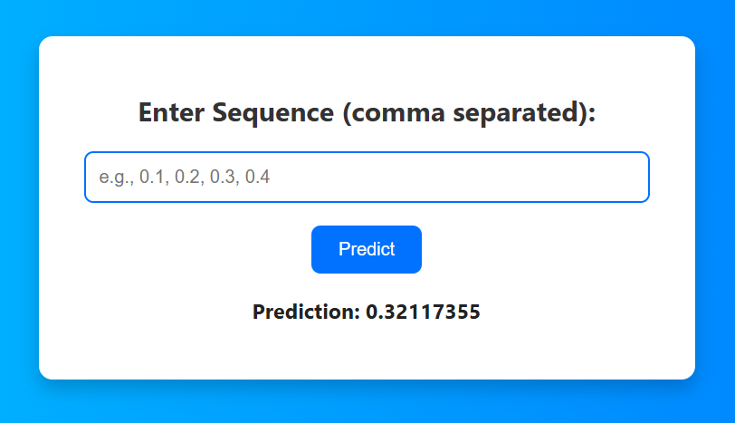
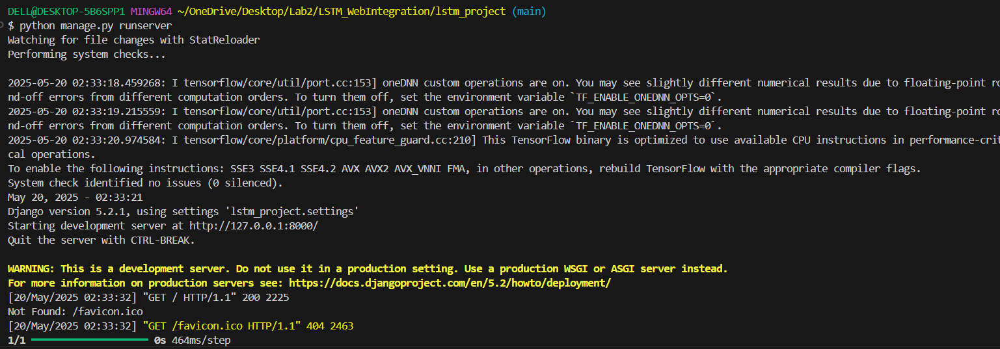

# LSTM_WebIntegration
### Long Short-Term Memory Project
LSTM is a special type of recurrent neural network used to learn patterns in sequential data. 

### Interface Preview 
Here is a screenshot of the application ran locally:

The interface allows users to enter a sequence of number separated by comma and see the predictions. When given input as 0.1,0.2,0.3,0.4 and 0.5, the model predict that the next value in the sequence is 0.32117.

Running the project locally
 

